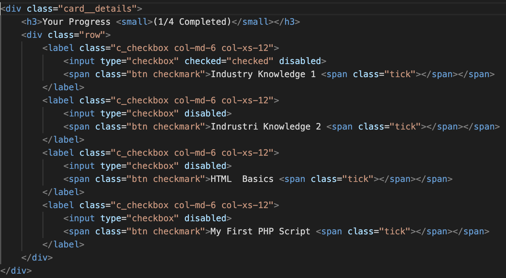

# Test for Front End Developer

### This project was bootstrapped with HTML3, CSS3, Specific Using SCSS and using Bootstrap V 3.2.0

## Favrouit code into this project is 

### A basic custom checkbox design would involve hiding the default checkbox input and styling a label element to act as the custom checkbox. This can be accomplished using CSS selectors and the :checked and :before/:after pseudo-elements. A more advanced custom checkbox design might involve adding additional interactive elements, such as animations or additional states (e.g. "indeterminate"). This can be accomplished using CSS transitions, animations, and JavaScript/jQuery to toggle classes and change the styles. In general, the complexity of creating a custom checkbox design in CSS will depend on the desired level of customization and interactivity, and it shows my experience with CSS and JavaScript.